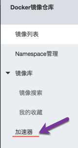

# README
[toc]
## Assumptions
* This is for linux platform;
* Docker engine is already installed on the linux box, otherwise please go to [How to Install Docker](https://docs.docker.com/engine/installation/linux/) for installation instructions;
* You have ssh key pair in place, and the pub key is ~/.ssh/id_rsa.pub

## Start a Docker container running debian with SSHD
Open a terminal, and run below commands -

``` bash
docker run --name my-virgin-debian -d -p 2222:22 -e SSH_KEY="$(cat ~/.ssh/id_rsa.pub)" krlmlr/debian-ssh
```
It will download the docker image, krlmlr/debian-ssh in our case, and start a container based on the image.  
**--name my-virgin-debian** : name the container as *my-virgin-debian*, it can be refer later with this name;  
**-d** : the container will run at background as daemon process;  
**-p 2222:22** : map the container's port *22* to host port *2222*, you can change 2222 to any arbitary ports;  
**-e SSH_KEY="$(cat ~/.ssh/id_rsa.pub)"** : install the pub key at *~/.ssh/id_rsa.pub* to the container, so you could login with this pub key. The keys will be installed for user root.  
**krlmlr/debian-ssh** : this is the images already exists in docker hub.   
 
Now the debian container with SSHD is running, we can ssh into that container(server) by -

* ```ssh -p 2222 root@localhost``` To connect with user root

## About Docker tutorial
1. Personally I like the official tutorial the most, [Learn by example](https://docs.docker.com/engine/tutorials/). Once you completed this tutorial, you will have some general idea about docker and some basic commands to work with docker.
2. For more details about docker commands, just type **docker** in the console;
3. Then you may want to create your own docker images. This is about how to write your own dockerfile [Dockerfile reference](https://docs.docker.com/engine/reference/builder/).
4. Now you have all your modules dockerized, you want to start/manage them as one single application(with multiple modules, e.g. mysql, wordpress), you probably want to know [Docker Compose](https://docs.docker.com/compose/overview/)
5. At the meantime you can learn by reading others' dockerfile and docker compose files at [Docker Hub](https://hub.docker.com/)
6. Also on Docker hub, you may find that someone else has already created an image that meets your requirement. 

## Other questions
1. tell me how to list/find my docker images and the ports/IP addresses
	* to list images ```docker images```, or ```docker images|grep debian``` to search for certian images;
	* ```docker ps```, which list currently running containeres with ports redirects. e.g.
	
		```c457e433d206        krlmlr/debian-ssh      "/run.sh"           2 minutes ago       Up 2 minutes        0.0.0.0:2222->22/tcp                                          my-virgin-debian```  
	
	* To get its IP address ```docker inspect my-virgin-debian |grep IPAddress```. For most cases, we won't use it's ip address, it's just an IP in its virtual lan, which could not be reached by external parties. We have setup up port redirect on the host, we use that instead, e.g. to ssh to the container, we use ```ssh -p 2222 root@localhost```.
2. tell me how to add my public key from SSH so SSH login is automatic
	We've already added the pub key on chapter [Start a Docker container running debian with SSHD](#start-a-docker-container-running-debian-with-sshd)
3. tell me how to list the docker things running and shut them down
	* list all running containers ```docker ps```;
	* list all containers(including stopped) ```docker ps -a```;
	* stop a container ```docker stop name```;
	* delete a container ```docker rm -f name```.
4. Do I use docker-compose if I want a virgin docker image, every time I run server?
	*docker-compose* is for applications have multiple containers. You don't need docker-compose for this purpose.  
	If you want a virgin debian everytime, you just re-creating the container, so everything you have changed in the old container is gone.   
	
	```
	docker rm -f my-virgin-debian
	docker run --name my-virgin-debian -d -p 2222:22 -e SSH_KEY="$(cat ~/.ssh/id_rsa.pub)" krlmlr/debian-ssh 
	```

## Install docker and docker-compose
### Prerequisites
* 64-bit Linux installation
* Version 3.10 or higher of the linux kernel  
To check kernel version with  

```bash
$ uname -r  
3.19.0-42-generic
```
### Ubuntu
#### (China)Apply apt sources
* Download respective `sources.list` file from below links
    * precise(12.04) - http://mirrors.163.com/.help/sources.list.precise
    * trusty(14.04) - http://mirrors.163.com/.help/sources.list.trusty
    * vivid(15.04) - http://mirrors.163.com/.help/sources.list.vivid
* Override `/etc/apt/sources.list` with downloaded file
* Execute `sudo apt-get update`

#### Install Docker Engine
Follow the instructions here - https://docs.docker.com/engine/installation/linux/ubuntulinux/  
#### Install Docker Compose
Follow instructons here - https://docs.docker.com/compose/install/
### CentOS
#### (China)Use `yum` repository
* Backup the old one

```bash
$ mv /etc/yum.repos.d/CentOS-Base.repo /etc/yum.repos.d/CentOS-Base.repo.backup
```
* Download respective repo files from below links and save to `/etc/yum.repos.d/`
    * CentOS7 - http://mirrors.163.com/.help/CentOS7-Base-163.repo
* Rebuild the cache

```bash
$ yum clean all
$ yum makecache
```
#### Install Docker Engine
Follow the instructions here - https://docs.docker.com/engine/installation/linux/centos/
#### Install Docker Compose
Follow instructions here - https://docs.docker.com/compose/install/
## Using mirrors for servers in China
### apt-get
Please refer to [(China)Apply apt sources](# (China)Apply apt sources).
### yum
Please refer to [(China)Use `yum` repository](#(China)Use `yum` repository).
### apk
Add `http://mirrors.aliyun.com/alpine/{VERSION}/main/` to the beginning of file `/etc/apk/repositories`.
***NOTE*** `{VERSION}` need to be replaced by actual version strings, such as `v3.2`, `v3.3` etc.
### pip
Update `~/.pip/pip.conf` file as below shows.

```info
[global]
index-url = http://mirrors.aliyun.com/pypi/simple/

[install]
trusted-host=mirrors.aliyun.com
```
Or Use the mirror directly in the commands as -

```bash 
pip install --trusted-host mirrors.aliyun.com -i http://mirrors.aliyun.com/pypi/simple/ --upgrade pip
```
### Docker registry
This section about how to use aliyun docker images services.  

* Create an Aliyun account(free)
* Go to https://cr.console.aliyun.com and login with your account
* Click "加速器" on the left sub-menu

  

* Get your exclusive mirror address


* if your system is Ubuntu 12.04/14.04, and Docker 1.9 or later.

```bash
echo "DOCKER_OPTS=\"\$DOCKER_OPTS --registry-mirror=https://xxxxxxx.mirror.aliyuncs.com\"" \
| sudo tee -a /etc/default/docker
sudo service docker restart
```
* For systems Ubuntu 15.04/16.04 and Docker 1.9 or later

```bash
sudo mkdir -p /etc/systemd/system/docker.service.d
sudo tee /etc/systemd/system/docker.service.d/mirror.conf <<-'EOF'
[Service]
ExecStart=
ExecStart=/usr/bin/docker daemon -H fd:// --registry-mirror=https://xxxxxx.mirror.aliyuncs.com
EOF
sudo systemctl daemon-reload
sudo systemctl restart docker
```

* For CentOS 7, and Docker 1.9 or later 

```bash
sudo cp -n /lib/systemd/system/docker.service /etc/systemd/system/docker.service
sudo sed -i "s|ExecStart=/usr/bin/docker daemon|ExecStart=/usr/bin/docker daemon \
--registry-mirror=https://xxxxxx.mirror.aliyuncs.com|g" /etc/systemd/system/docker.service
sudo systemctl daemon-reload
sudo service docker restart
```

***NOTE*** Please replace `xxxxxx.mirror.aliyuncs.com` with your own link.
### Others
There are other mirrors/services available for developers in China.

* Netease - http://mirrors.163.com/
* Aliyun - http://mirrors.aliyun.com/
* NPM - https://npm.taobao.org/
