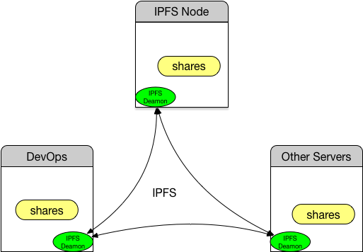

# Working with IPFS
[TOC]
## Overview
As below picture shows, each region/country will have one **IPFS NODE**. This **IPFS NODE** shares files such as docker image export files, apt packages, pip packages etc. And other servers, say DevOps server, will get the docker images from the **IPFS NODE** through *IPFS* instead of pulling from docker hub.    

## Setup
### Assumptions
* All servers are Linux 64bit

### Prerequisites
* git is installed
* Docker engine is installed on **IPFS NODE**
* Docker engine and Docker-compose are installed on **DevOps** server

### Common steps for all servers
* Checkout the *devops* github repository to your workspace(workspace could be any folder, will call it `$workspace` hereafter.)   

  ``` bash
  git clone https://github.com/skycoin/devops.git`
  ```
* Create **shares** folder under devops and unzip/install ipfs  

  ```bash
  cd $workspace/devops
  tar zxvf tools/go-ipfs_v0.4.4_linux-amd64.tar.gz -C /tmp
  sudo cp /tmp/go-ipfs/ipfs /usr/local/bin/
  ```
  
* Initialize ipfs and start the daemon process

  ``` bash
  ipfs init 
  ipfs daemon
  ```
  One of command `ipfs init`'s outputs is the peer id, save the one of **IPFS NODE** for later use, we will refer it as `$peerid` hereafter.
  
### Setup the IPFS NODE
* Get the docker images

    ``` bash
    mkdir -p $workspace/devops/shares
    cd $workspace/devops/shares
    docker save -o debian tutum/debian:wheezy
    docker save -o python python:2.7
    docker save -o alpine-sshd gaff/alpine-sshd:1.0
    ```

* Share the folder

    ``` bash
    cd $workspace/devops/
    ipfs add -r shares
    ipfs name publish $folder_hash
    ```
`$folder_hash` is the hash code of folder shares, could get from previous command `ipfs add -r shares`.   
Now other servers running ifps daemon can access this folder as 

    ``` bash
    ipfs ls /ipns/$peerid #list the shares folder
    ipfs get -o debian /ipns/$peerid/debian 
     #get the file named debian on IPFS NODE
    ```
    
### Setup on DevOps Server
This is similar to other servers. 

* mount the shares

    ``` bash
    sudo mkdir -p /ipfs /ipns
    ipfs mount
    sudo ln -s /ipns/$peerid $workspace/devops/shares
    ```
Now all files shared by **IPFS NODE** could be access from $workspace/devops/shares.
* import the images

    ``` bash
    cd $workspace/devops/shares
    docker load -i debian
    docker load -i python
    docker load -i alpine-sshd
    ```
